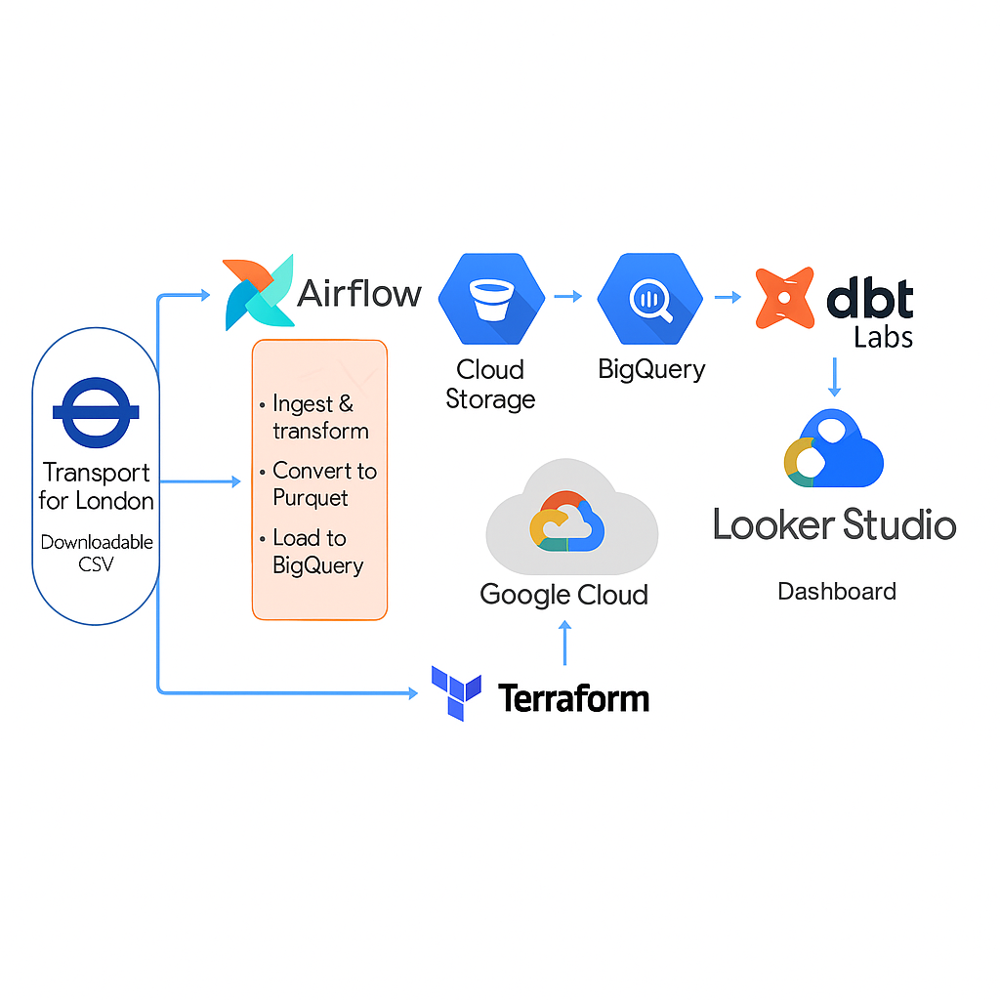

# London Transport

Project: 

This is my first project to asses the results of several month of learning data engineering knowledge area.
I will use knowledge gained from DataCamp, DataQuest courses and Data-engineering-zoomcamp sessions from DTC on Githab. 

Business case description:

The aim is to estimate and visualize TFL's cycling usage to:
- to monitor cycling volumes in London over time;
- to undertake counts before and after the delivery of each TfL Cycleway in order to assess the impact of the investment on cycle flows (and sometimes also on general traffic flows) along the Cycleway route.

Scope:
- Creating a pipeline for processing a dataset and putting it to a datalake
- Creating a pipeline for moving the data from the lake to a data warehouse
- Transforming the data in the data warehouse: prepare it for the dashboard
- Building a dashboard to visualize the data

Documentation:
- Terrafom - Infrastructure as a code;
- dbt project documentation;

Data:
- Public TfL data (or 'open data') released here is for open data users to use in their own software and services.

base url: https://cycling.data.tfl.gov.uk/ 

Methodology reference: 
https://cycling.data.tfl.gov.uk/ActiveTravelCountsProgramme/%20Strategic%20active%20travel%20counts%20-%20release%20note.pdf

Data set info
- Name: cycling.data.tfl.gov.uk
- Type: URL endpoints
- Data dictionary: Not included

Source system: 
- third-party, name "Transport for London", type=downloadable CSV.
- Schema is to be created as a part of the project. Frequency of schema changes and notifcation policy on the source system are uknown. [risk 1]

Storage:

Object storage (GCS) from Google Cloud Platform is used as a storage layer for a data warehouse by Google BigQuery.

Ingestion:

- batch frequency based pipeline, Airflow

Risks:
- risk1

Technologies:
- Cloud: AWS, GCP
- Infrastructure as code (IaC): Terraform
- Workflow orchestration: Airflow
- Data Warehouse: BigQuery
- Data modeling: dbt 
- Batch processing: python
- Stream processing: no

# Dashboard

Report is made in Looker Studuo.

🚲 TfL Cycle Counts Dashboard https://lookerstudio.google.com/reporting/14de3dbc-45cc-459f-bc57-d26f43a692ad

🔷 Key Themes: Cycle counts (Flow) Based Metrics 

|Metric|	Why It’s Valuable|	Notes|
|-----|----|----|
|Daily Average Flow|	Core metric for planning and capacity. Identifies high-usage monitoring locations.	|Based on 15-minute aggregated count data (6am–10pm, weekdays)|
|Change vs 2019 / 2015|	Measures pre-/post-pandemic trends and long-term changes.|	Calculated from annualized/seasonal averages per location|
|Seasonal Variation|	Reveals behavior differences between Spring and Autumn.|	Based on wave (e.g., 2019 Q2 spring).|
|By Borough / Area|	Enables targeted interventions in Central, Inner, Outer London.|Based on functional area and borough|

🔷 Key Themes: Cycle Network-Based Metrics

|Metric|	Why It’s Valuable|	Notes|
|-----|----|----|
|Cycling Volume (cycle-km)|	Estimates how much cycling activity is observed across the network, adjusted by group length.|	⚠️ Not equivalent to distance travelled per person.|
|Cycling Intensity (cycle-km/km)|	Usage density – how heavily used the network is per km.|	Supports network performance benchmarking|
|Group Sample Expansion|	Validates network-wide volume estimates by combining flow with group length|	group_avg_flow × group_length_km|
|Road Type Contributions|	Reveals which road classes support the most cycling activity |	road_type dimension in volume model|
|Network Coverage by Area|	Compares infrastructure availability across Central, Inner, Outer.|	From total_network_km in intensity|

Strategic Questions to Explore

|Question|	What It Helps Answer|
|----|----|
|🚴 Where is cycling growing or declining?|	Highlights impact zones, planning priorities|
|🕗 What are the peak periods of activity?|	Helps manage congestion and infrastructure scheduling|
|🔄 Has commuting flow direction changed?|	Reveals post-COVID commute reversal or dispersion|
|🌆 Which areas show low usage despite infrastructure? |	Flags potential inefficiencies or underperformance|
|📈 Has cycling recovered or increased since 2019? |	Critical for evaluating post-pandemic rebound|
|🛣️ Do A-roads or residential streets support more flow? |	Informs reallocation of cycling lanes/facilities|
|📐 Which areas achieve high network efficiency (intensity)? |	Identifies high-performing boroughs/groups|

Dashboard Captions & Disclaimers

Metrics like cycle-km and cycle-km/km reflect cycling activity observed on the infrastructure, not personal trip lengths or number of trips.

Without LTDS stage data, it is not possible to infer actual trip distances or trip counts.

# Reproducibility
## Set up the infrastructure
1. Create a new project in Google Cloud Platform and set up Google service account with necessary roles.
2. Set up cloud environment necessary for the project: VM, SSH.
    - install Terraform
    - use main.tf with basic config and resources: VM with SSH, Google Cloud Storage bucket, Google BigQuery dataset, IAM rules, Docker installation script
3. Set up Airflow environmnet with Docker for a workflow orchestartion:
    - Dockerfile
    - docker-compose.yml 
    - requirememts.txt

4. Make the set up production-ready. TBD Skip for now

## Create a pipeline for processing a dataset and putting it to a datalake and DWH
5. Ingest data to GCS, make basisc transformation, load to Biquery staging dataset 
- Prepare the data during the injestion:
    - handle missing values 
    - remove duplicates 
    - fix incosistent datadefine data types
    - check for completeness
    - check and harmonize column names  

- load counts data for all available periods by running the following DAGs
    - ~/airflow/dags/data_ingestion_gcs_cycleways_dag.py
    - ~/airflow/dags/data_ingestion_gcs_strategic_active_counts_dag.py
    -  ~/airflow/dags/data_ingestion_gcs_monitoring_locations_dag.py

### Notes:

csv data files are structured by
- The strategic active travel counts programme
- The Cycleway counts programme
- The (legacy) central London quarterly cycle counts programme – now discontinued

Picularities discovered after investigating https://cycling.data.tfl.gov.uk/ which contains CSV files.

Discovery 1:

The file name part in the base URL is not consistent throughout the list.
https://cycling.data.tfl.gov.uk/ActiveTravelCountsProgramme/2017%20Q2%20spring%20(Apr-Jun)-Cycleways.csv

https://cycling.data.tfl.gov.uk/ActiveTravelCountsProgramme/2023%20W2%20autumn-Cycleways.csv

Discovery 2: 

The returned HTML (BeautifulSoup library (from the bs4 package) to parse an HTML document and extract links to files ending with Cycleways.csv') appears to represent a page dynamically listing an Amazon S3 bucket's contents.

Discovery 3:

F12 on the page https://cycling.data.tfl.gov.uk/ reveals that URLs (requests) that I need have the following structure:
- https://s3-eu-west-1.amazonaws.com/cycling.data.tfl.gov.uk/ActiveTravelCountsProgramme/2016%20Q4%20autumn%20(Oct-Dec)-Cycleways.csv

There is an XML https://s3-eu-west-1.amazonaws.com/cycling.data.tfl.gov.uk/ 

**Solution**: Create a list of URLs from the XML data and incorporate it into the pipeline. Programmatically fetch and parse it to extract the <Key> elements. Since the XML contains the file paths (<Key>), we construct the full URLs by appending these keys to the S3 bucket base URL (https://s3-eu-west-1.amazonaws.com/cycling.data.tfl.gov.uk/).

Discovery 4: 

As a result of Airflow DAG task log, I found the issues that arises due to malformed rows where some data spills into the next line. These rows are missing the proper closing quotation marks or delimiters, resulting in inconsistent column counts during processing.

**Solution**: Fix Malformed Rows by preprocessing the CSV to correct the malformed rows before converting it to Parquet.

## Prepare the data in DWH for analalysis
Connect dbt development environment to BiGQuery BigQuery tfl_cycle_dev dataset.

Use dbt cloud to create a pipeline which 
- takes the external table from BigQuery tfl_cycles datasest, 
- prepare the data by running SQL models in BigQuery tfl_cycle_dev dataset
    - ~/dbt/models/staging/stg_active_counts.sql
    - ~/dbt/models/staging/stg_cycleways.sql
    - ~/dbt/models/staging/stg_monitoring_locations.sql
    - ~/dbt/models/staging/schema.yml
    
## Calculate group lengths, the weekday cycle-km and cycle-km/km 

Group lengths calculation

https://cycling.data.tfl.gov.uk/ contains additional files not mentioned in the release note. Files that likely contains data about Cycling Infrastructure. CycleRoutes.json contains the data required to calculate the group length 

Check the Methodology to create the measures
'The cyclable network is the union of the road network and all off-road, cyclable paths in London. Both of these (including metadata about road types) are publicly available as GIS layer files from sources such as the Ordnance Survey (for example OS Highways) and others, and TfL’s specialist teams routinely use these datasets' 

SQL approach or pipeline processing CycleRoutes.json failed because of the data structure.
I used QGIS to manually map London Areas (Inner, Outer, Central) and calculate group length by Area, by road type.
Data sources: CycleRoutes.json, TQ_RoadLink filetered esri file from OS Open Roads , Strategic_Monitoring_Areas.kml from London Gov database.  

--projects/my-first-de-project/GIS/clean_group_length.py

Calculation of the weekday cycle-km (cycling volume) is done at the sampling group level as the product of the group’s length and the average of flows for all available data points in that sampling group and then aggregated to the central, inner, outer level or to a London total

-- models/marts/fct_weekday_cycle_km_volume.sql

Calculation of the weekday cycling intensity (kilometres cycled per kilometre of cyclable network) is the product of dividing the total kilometres cycled in the area of interest (central, inner, outer or all London) by the total length of the cyclable network in that same area.
-- models/marts/fct_weekday_cycle_km_per_km.sql

Further calculations and aggregations require - LTDS data. 
The LTDS collects information about cycling stages and this information includes the coordinates of the origin and destination, from which a stage length can be calculated. This offers a source to calculate an average stage length as required.

Use    
and run the models from the Mart level.